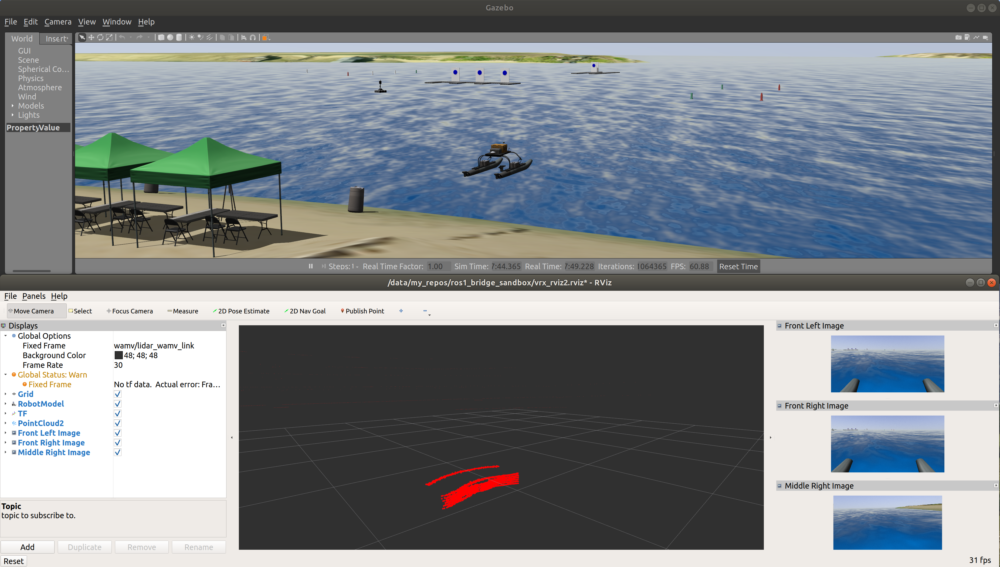

Minimal packages to demonstrate the usage of
[`ros1_bridge`](https://github.com/ros2/ros1_bridge), a communication channel
between ROS 1 and ROS 2.
The bridge allows packages in ROS 1 and ROS 2 to run simultaneously, so that
ROS 1 packages can be incrementally migrate to ROS 2.

Built-in message and service types are automatically bridged, with no
additional work required.
See [`ros1_bridge`](https://github.com/ros2/ros1_bridge) for more details of
basic usage.
Essentially, all that is required is to run the bridge.

Custom message and service types require recompilation of the bridge.
A few extra steps are required for the setup.
Here, a minimal example is used to demonstrate how to get the bridge working
with a custom message type.


# Prerequisites

This package has been tested in Ubuntu 18.04 with
* ROS 1 Melodic
* ROS 2 Dashing

A Dockerfile with the prerequisites is provided.


# Basic usage: bridge built-in data types

This example demonstrates how to bridge communication between publisher and
subscriber across ROS 1 and ROS 2, for a built-in message type
(`std_msgs/Float32`).

For built-in types, one has simply to run a publisher, a subscriber, and the
bridge.

Shell 1, run a ROS 1 publisher of a built-in message type:

```
. /opt/ros/melodic/setup.bash
roscore &
python ros1_bridge_sandbox/ros1_msgs_ws/src/bridge_msgs/src/bridge_msgs/ros1_pub_iltin.py
```

Shell 2, run a ROS 2 subscriber to the same message:
```
. /opt/ros/dashing/setup.bash
python3 ros1_bridge_sandbox/ros2_msgs_ws/src/bridge_msgs/src/ros2_sub_builtin.py
```

Note that simply echoing the message without an existing subscriber would not
work.
The bridge requires a subscriber to exist in order to bridge topics.

Shell 3, run the bridge.
For built-in message, you can simply run the bridge as is, such as from the
Debian package.
It does not need to be recompiled.
```
. /opt/ros/melodic/setup.bash
. /opt/ros/dashing/setup.bash
ros2 run ros1_bridge dynamic_bridge
```

Sample output from Shell 1:
```
published floating_point 0.748500
published floating_point 0.225652
published floating_point 0.091966
published floating_point 0.147991
```

Sample output from Shell 2:
```
received floating_point 0.748500
received floating_point 0.225652
received floating_point 0.091966
received floating_point 0.147991
```


# Bridge a custom data type

This example demonstrates how to bridge communication between publisher and subscriber across ROS 1 and ROS 2, for a custom message type.

## Set up shells and compile packages

We are going to compile two identical message types, one in a ROS 1 workspace,
the other in a ROS 2 workspace.
We will recompile the bridge afterwards, so that it recognizes these new custom
messages.

Shell 1, compile ROS 1 custom message and run ROS 1 core:
```
. /opt/ros/melodic/setup.bash
cd ros1_bridge_sandbox/ros1_msgs_ws
catkin_make_isolated --install
. devel_isolated/setup.bash
# Run roscore in the background. Press enter to get a clean prompt
roscore &
```

Shell 2, compile ROS 2 custom message and run a publisher:
```
. /opt/ros/dashing/setup.bash
cd ros1_bridge_sandbox/ros2_msgs_ws
colcon build --packages-select bridge_msgs
. install/local_setup.bash
```

Shell 3, clone and compile `ros1_bridge` from source to recognize the custom message we just compiled above:
```
mkdir -p ros1_bridge_sandbox/bridge_ws/src
cd ros1_bridge_sandbox/bridge_ws/src
git clone https://github.com/ros2/ros1_bridge.git
cd ..
. /opt/ros/melodic/setup.bash
. /opt/ros/dashing/setup.bash
# Source the two new messages we compiled above
. ~/ros1_bridge_sandbox/ros1_msgs_ws/install_isolated/setup.bash 
. ~/ros1_bridge_sandbox/ros2_msgs_ws/install/local_setup.bash 
# Compile ros1_bridge and source it
colcon build --packages-select ros1_bridge --cmake-force-configure
. install/local_setup.bash
# This should print:   - 'bridge_msgs/JointCommand' (ROS 2) <=> 'bridge_msgs/JointCommand' (ROS 1)
ros2 run ros1_bridge dynamic_bridge --print-pairs | grep bridge
```

If the `grep` does not print anything, verify that the ROS 1 and ROS 2 messages are both recognized in this shell:
```
$ rosmsg show bridge_msgs/JointCommand
float64 position
$ ros2 msg show bridge_msgs/JointCommand
float64 position
```

and that you sourced the newly compiled bridge:
```
. ~/ros1_bridge_sandbox/bridge_ws/install/setup.bash
```

In Shell 3, run the bridge, which will carry messages across ROS 1 and 2:
```
ros2 run ros1_bridge dynamic_bridge
```

## Run the example: ROS 2 publisher and ROS 1 subscriber

Keeping the same shell ordering as the setup above, and the bridge running
in Shell 3, the following example show publishers and subscribers on both sides
of the bridge.

Shell 2, publish in ROS 2 to ROS 1.
This publishes `bridge_msgs/JointCommand` type to `/joint_command` topic:
```
$ python3 src/bridge_msgs/src/ros2_pub.py
Published joint_command
Published joint_command
Published joint_command
Published joint_command
```

Shell 1, subscribe to ROS 2 messages in ROS 1:
```
$ rosrun bridge_msgs ros1_sub.py
[INFO] [1571738769.812788]: 0.703536987438
[INFO] [1571738769.866240]: 0.620796272812
[INFO] [1571738769.919718]: 0.615485199642
[INFO] [1571738769.972993]: 0.556240315522
```

If the executable is not found, make sure you have sourced the package:
```
. devel_isolated/setup.bash 
```

## Run the example: ROS 1 publisher and ROS 2 subscriber

Keeping the bridge running in Shell 3, try the other direction, subscribing to
ROS 1 messages in ROS 2.

Shell 1:
```
$ rosrun bridge_msgs ros1_pub.py
published joint_command 0.337332
published joint_command 0.004804
published joint_command 0.022121
published joint_command 0.100489
```

Shell 2:
```
$ python3 src/bridge_msgs/src/ros2_sub.py
received joint_command 0.337332
received joint_command 0.004804
received joint_command 0.022121
received joint_command 0.100489
```


# Bridge a ROS 1 robot simulation to ROS 2

This example demonstrates communication for a more complex system, a simulated
robot in ROS 1, which will be bridged to talk to RViz2 and code in ROS 2.
Since many existing robots run on ROS 1, this shows a starting point of making
those robots talk to ROS 2.

Sample scripts have been written to work with the 
[VRX simulation environment](https://bitbucket.org/osrf/vrx), which features a
maritime surface vehicle in ROS 1.
A similar setup should work with any other robot.

## Install VRX simulation world

To try it out on the VRX robot, you will need to install the VRX environment.
Follow the [installation tutorials](https://bitbucket.org/osrf/vrx/wiki/tutorials).
Several installation methods are available.

* [Debian install](https://bitbucket.org/osrf/vrx/wiki/tutorials/SystemSetupInstall) is the simplest way:
   ```
   sudo apt install ros-melodic-vrx-gazebo
   ```

* Alternatively, you can [install from source](https://bitbucket.org/osrf/vrx/wiki/tutorials/SystemSetupInstall).
Clone the VRX simulation repository to a desired location, compile and source the packages:
   ```
   mkdir -p vrx_ws/src
   cd vrx_ws/src
   hg clone https://bitbucket.org/osrf/vrx
   . /opt/ros/melodic/setup.bash
   cd ..
   catkin build
   . devel/setup.bash
   ```

* A third alternative is to [install the VRX Docker image](https://bitbucket.org/osrf/vrx/wiki/tutorials/SystemSetupDocker).
Docker X-server support is required to run Gazebo in Docker.
If you choose this option, you may want to [install NVIDIA Docker](https://bitbucket.org/osrf/vrx/wiki/tutorials/installNvidiaDocker) to speed up rendering.

## Bridge built-in sensor messages from ROS 1 to ROS 2 RViz 2

This section shows how to visualize ROS 1 built-in sensor messages in ROS 2
RViz 2, using the bridge.
This allows us to read data from ROS 1 in ROS 2.

Once the VRX environment is installed, run the following commands in several new terminals.

Shell 1, launch VRX simulation in ROS 1:
```
. /opt/ros/melodic/setup.bash
roslaunch vrx_gazebo vrx.launch
```
Shell 2, run the bridge:
```
. /opt/ros/melodic/setup.bash
. /opt/ros/dashing/setup.bash
ros2 run ros1_bridge dynamic_bridge --bridge-all-topics
```
Note that `--bridge-all-topics` must be specified.

Shell 3, run RViz 2 in ROS 2:
```
. /opt/ros/dashing/setup.bash
ros2 run rviz2 rviz2
```

In RViz, load (File menu, Open Config) the provided `.rviz` configuration file.
Alternatively, manually set Fixed Frame under Global Options to
`wamv/lidar_wamv_link`, and add PointCloud2 topic
`/wamv/sensors/cameras/lidar_wamv/points`,
Image topics `/wamv/sensors/cameras/front_left_camera/image_raw`,
`/wamv/sensors/cameras/front_right_camera/image_raw`,
and `/wamv/sensors/cameras/middle_right_camera/image_raw`.

The three images and point cloud visualization should show up in RViz 2.



## Bridge built-in robot commands from ROS 2 to ROS 1

This section shows how to send commands from a ROS 2 node to a robot running in ROS 1.
This allows us to write new algorithms in ROS 2 and execute the commands to control a ROS 1 robot.

Shell 4, run a ROS 2 node to subscribe to built-in data types in ROS 1:
TODO: Test this
```
. /opt/ros/dashing/setup.bash
ros2 run bridge_msgs demo_vrx_read.py
```

Run a ROS 2 node to publish to built-in data types in ROS 1:
TODO: Test this
```
ros2 run bridge_msgs demo_vrx_write.py
```

